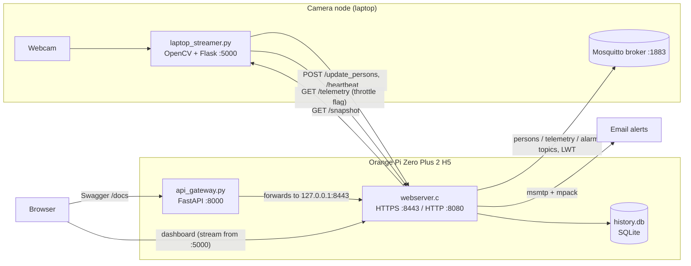

# Smart Security Monitoring System on Orange Pi

A lightweight, real-time security monitoring system built around an **Orange Pi Zero Plus 2 (Allwinner H5)**. A camera node runs face-based person detection and streams video. The Orange Pi runs a **hand-written HTTPS server in C** that gathers detections and system telemetry, sends email alerts with snapshots, publishes events over **MQTT**, and keeps a persistent **SQLite** event log. It also monitors its own health with a software watchdog and adaptive thermal management.

This was the final project for the **Real-Time Embedded Systems** course at Sharif University of Technology. The full write-up is in [`report-embeded-project-401101932.pdf`](report-embeded-project-401101932.pdf) (in Persian). It documents every experiment summarized below, with screenshots.

---

## Features

**Core server (C, on the Orange Pi)**
- HTTPS server written with raw sockets and OpenSSL, using a self-signed certificate (CN = student ID)
- An HTTP listener on port 8080 that sends a `301` redirect to HTTPS on port 8443
- A live HTML dashboard showing the camera stream, CPU temperature, CPU load, free RAM, and person count
- A REST API for telemetry, detections, history, and system commands
- Runs as a `systemd` service with `Restart=always`, so it starts headless at boot and recovers from crashes

**Detection and alerting**
- Person detection with an OpenCV Haar cascade on the camera node, using frame skipping and downscaled detection to keep it fast
- The camera node pushes the person count to the server only when the count changes
- Email alerts with an attached snapshot, sent through `msmtp` and `mpack`, with a 30 s debounce to avoid spamming the inbox
- MQTT publishing with authentication (no anonymous access) and a **Last Will and Testament** message, so subscribers see the board go `OFFLINE` if it dies unexpectedly

**Extended features**
- **Guard Mode:** a toggle in the dashboard or via the API. While active, the email debounce drops to 5 s and every detection is also published to an emergency `alarm/` MQTT topic.
- **Blackbox:** a persistent SQLite detection history kept as a circular buffer of the 100 most recent records, with an endpoint that reports total historical detections
- **Software watchdog:** the camera node sends a heartbeat every 10 s. If nothing arrives for 30 s, the server sends a "Camera Tampering" email and restarts its own service.
- **Adaptive thermal management:** above 65 °C the server sets a throttle flag and sends a thermal alert email. The camera node then lowers its detection rate (it runs detection on every 10th frame instead of every 3rd). Normal operation resumes below 60 °C.
- **API gateway:** a thin FastAPI layer that forwards requests to the C backend and provides interactive Swagger docs at `/docs`
- **Secrets kept out of the source:** MQTT credentials and the alert address are read from a separate `secrets.txt` at startup

---

## Architecture



The C server stays deliberately small (about 4.4 MB resident memory). The compute-heavy vision work runs on the camera node, and the board handles coordination, alerting, and monitoring.

---

## Repository Structure

```
.
├── code and scripts/
│   ├── webserver.c                    # Main HTTPS server (C, OpenSSL, libmosquitto, SQLite)
│   ├── webserver.service              # systemd unit for the C server
│   ├── api_gateway.py                 # FastAPI/Swagger gateway forwarding to the C backend
│   ├── apigateway.service             # systemd unit for the gateway (Requires=webserver.service)
│   ├── laptop_streamer.py             # Final camera node: detection, MJPEG stream, heartbeat, throttle handling
│   ├── laptop_streamer_temp_3_3.py    # Variant used for the resolution experiment (Test 3-3)
│   ├── laptop_streamer_temp_3_5       # Variant with ms timestamps for the latency experiment (Test 3-5)
│   ├── log_temp.sh                    # Logs CPU temperature to CSV every 30 s
│   ├── log_mem.sh                     # Logs webserver RSS memory to CSV every 5 s
│   ├── load_test.sh                   # 50 concurrent curl loops against /api/v1/telemetry for 30 s
│   ├── plot.py                        # Plots temperature and memory profiles
│   ├── temp_idle.csv / temp_stream.csv / temp_log.csv   # Thermal profiling data
│   └── mem_log.csv                    # Memory profiling data
└── report-embeded-project-401101932.pdf   # Full project report (Persian)
```

---

## REST API

The C server serves these endpoints on `https://<pi-ip>:8443`. The FastAPI gateway exposes the same paths on `http://<pi-ip>:8000`, with Swagger docs at `/docs`.

| Method | Endpoint | Description |
|---|---|---|
| `GET` | `/api/v1/telemetry` | CPU temperature, free memory, CPU load, thermal throttle flag |
| `GET` | `/api/v1/persons` | Current person count with timestamp |
| `GET` | `/api/v1/history` | Last 5 detection records (in memory) |
| `GET` | `/api/v1/total_detections` | Sum of detections stored in the SQLite blackbox |
| `GET` | `/api/v1/stream` | Redirect to the MJPEG stream URL |
| `POST` | `/api/v1/command` | System command, e.g. `{"cmd": "reboot"}`. Unknown commands return an error. |
| `POST` | `/api/v1/guard` | Toggle Guard Mode: `{"state": 1}` or `{"state": 0}` |
| `POST` | `/api/v1/heartbeat` | Watchdog heartbeat from the camera node |
| `POST` | `/api/v1/update_persons` | Person count update from the camera node: `{"count": n}`. Also counts as a heartbeat. |

### MQTT Topics

| Topic | Payload |
|---|---|
| `persons/401101932/home` | `{"student_id", "count", "timestamp"}`, published on count change |
| `telemetry/401101932/home` | `{"student_id", "cpu_temp", "timestamp"}`. Also carries the retained LWT `{"status":"OFFLINE"}`. |
| `alarm/401101932/home` | Same as `persons`, published only in Guard Mode when people are detected |

---

## Setup

### 1. Orange Pi (server)

Install the dependencies:

```bash
sudo apt install build-essential libssl-dev libmosquitto-dev libsqlite3-dev msmtp mpack wget python3-pip
pip3 install fastapi uvicorn requests
```

Generate the self-signed certificate in the working directory (`/home/guard`):

```bash
openssl req -x509 -newkey rsa:2048 -nodes -keyout server.key -out server.crt -days 365 -subj "/CN=401101932"
```

Set `LAPTOP_HOSTNAME` in `webserver.c` to the address of the machine running the MQTT broker. Then compile:

```bash
gcc webserver.c -o webserver -lssl -lcrypto -lmosquitto -lsqlite3 -lpthread
```

Create `/home/guard/secrets.txt`. Keep this file out of version control.

```
MQTT_USER=<mqtt-username>
MQTT_PASS=<mqtt-password>
ALERT_EMAIL=<address-to-receive-alerts>
```

Configure `~/.msmtprc` with your SMTP account. For Gmail, use an App Password rather than your account password.

Install and enable the services:

```bash
sudo cp webserver.service apigateway.service /etc/systemd/system/
sudo systemctl daemon-reload
sudo systemctl enable --now webserver.service apigateway.service
```

> The watchdog and the `reboot` command call `sudo systemctl restart` and `sudo reboot`. The `guard` user therefore needs a passwordless sudoers rule for those specific commands.

### 2. MQTT broker (Mosquitto)

Add these lines to `mosquitto.conf`:

```
listener 1883 0.0.0.0
allow_anonymous false
password_file <path-to-passwd-file>
```

Create the user:

```bash
mosquitto_passwd -c <path-to-passwd-file> <mqtt-username>
```

### 3. Camera node (laptop)

```bash
pip install opencv-python flask requests
```

Set `ORANGE_PI_IP` in `laptop_streamer.py`, then run it:

```bash
python laptop_streamer.py
```

Open `https://<pi-ip>:8443` for the dashboard and `http://<pi-ip>:8000/docs` for the API docs.

---

## Results

All of the following were measured on the Orange Pi Zero Plus 2 H5. Details and screenshots are in the report.

**Reliability**
- **Boot:** `webserver.service` is active about **9.25 s** after boot (`systemd-analyze critical-chain`). Cold boot works headless with no monitor or keyboard attached.
- **Crash recovery:** after `kill -9`, systemd restarts the server automatically with a new PID. Subscribers receive the MQTT LWT `OFFLINE` message immediately, and normal publishing resumes once the service is back.
- **Network drop:** the server does not crash while the network is down. After reconnecting, a page reload restores the stream and telemetry with no manual intervention.
- **Memory:** the server's RSS stayed flat at about **4.4 MB** across 60 samples over 5 minutes, with no growth suggesting a leak.

**Thermal profile (maximum over 5 minutes)**

| Scenario | Max CPU temp |
|---|---|
| Idle | 49.4 °C |
| Video streaming | 53.5 °C |
| Streaming + active detection | 55.1 °C |

**Resolution trade-off**

| Resolution | FPS | CPU temp (after 5 min) | Detection quality |
|---|---|---|---|
| 320×240 | 15.0 | 49.6 °C | Unstable |
| **640×480** | **15.7** | **50.5 °C** | **Good (chosen default)** |
| 1280×720 | 7.5 | 57.5 °C | Very good |

**Detection under different lighting (approximate)**

| Lighting | Accuracy |
|---|---|
| Daylight | ~90% |
| Artificial light | ~90% |
| Low light | ~70% |
| Backlit | ~40% |

**End-to-end latency** from detection on the camera node to MQTT message arrival, measured on a single clock to avoid clock drift between devices: mean **0.627 s**, standard deviation **0.373 s** over 10 events. The largest spike happened while the server was also fetching a snapshot and sending an alert email.

**Stress test:** with 50 concurrent request loops running on the board, CPU temperature rose to 56.6 °C and the dashboard timed out. The server recovered immediately once the load stopped.

**Thermal throttling test:** with `stress --cpu 4`, the board reached 66 °C. The camera node switched to throttled mode, showing a red `THROTTLED` overlay, and its FPS dropped from about 24 to 13. A thermal alert email was also sent.

**Security tests**
- Anonymous MQTT connections and wrong-password connections are rejected (`not authorised`).
- SSH root login is disabled (`PermitRootLogin no`).
- HTTP requests are redirected to HTTPS with a `301`.

---

## Known Limitations

- **Single-threaded accept loop:** the C server handles one connection at a time, so heavy concurrent traffic causes timeouts. This was a deliberate trade-off for a small footprint, but a thread pool or `epoll` would fix it.
- **Spoofable detection:** Haar cascades only match 2D patterns, so a photo shown on a phone screen counts as a person. Possible fixes are liveness or blink detection, texture analysis with a CNN, or a depth/IR camera.
- **Minimal HTTP parsing:** requests are routed by string matching rather than a full HTTP parser.
- **Self-signed certificate:** clients skip certificate verification (`verify=False`, `curl -k`), which is acceptable on a LAN but not for deployment.
- **Hard-coded IPs:** the board and laptop addresses are compile-time and script constants.

---

## Author

**Mohammadreza Sharifi**
B.Sc. Electrical Engineering (Electronics), Sharif University of Technology
